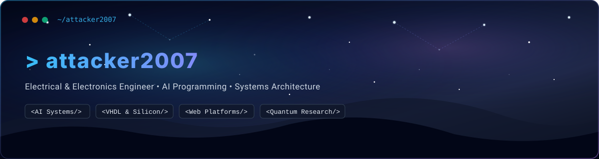

<div align="center">
  

  <br />

  <a href="https://github.com/attacker2007">
    
  </a>

  <br />

  <p align="center">
    <a href="https://github.com/attacker2007"></a>
    
  </p>
</div>

---

### 💻 `whoami`

```yaml
identity:
  alias: attacker2007
  role: Electrical & Electronics Engineer & Software Developer
  domain: AI Programming, Systems Development & Full-Stack Web

core_competencies:
  - High-performance systems programming & hardware modeling
  - Applied Artificial Intelligence & Intelligent Automation
  - Modern full-stack web applications & responsive UI/UX
  - Research in quantum computing & chip architecture

philosophy: "Continuous learning through research, experimentation, and execution."
```

---

### 🛠️ Technical Stack & Tooling

<div align="center">

#### Languages & Core


#### Systems, Hardware & Development Tools


#### Web & Frameworks


</div>

---

### 🚀 Projects & Technical Focus

<table>
  <tr>
    <td width="50%" valign="top">
      <h4>🌐 Web Engineering & Production Platforms</h4>
      <ul>
        <li>Active contributor and maintainer of high-traffic production web platforms.</li>
        <li>Focusing on performance optimization, responsive UX, and scalable frontend architectures.</li>
      </ul>
    </td>
    <td width="50%" valign="top">
      <h4>🧠 AI, Embedded & Systems Programming</h4>
      <ul>
        <li>Developing algorithmic pipelines with Python, C++, and hardware description languages (VHDL).</li>
        <li>Exploring quantum algorithms, silicon chip architectures, and AI integration.</li>
      </ul>
    </td>
  </tr>
</table>

---

### 🔬 Technical Research & Domains of Interest

- ⚛️ **Quantum Computing & Quantum Algorithms** — Exploring quantum circuit simulations and computational complexity.
- ⚡ **Chip Architecture & Digital Logic Design** — Silicon architecture, hardware description (VHDL), and low-level optimization.
- 🤖 **Applied Machine Learning & AI Systems** — Neural architectures, automated pipelines, and intelligent interfaces.
- 🌐 **Distributed Systems & Web Infrastructure** — Modern web standards, asynchronous paradigms, and high-availability design.

---

<div align="center">
  <sub>Built with ❤️ by <a href="https://github.com/attacker2007">attacker2007</a></sub>
</div>
